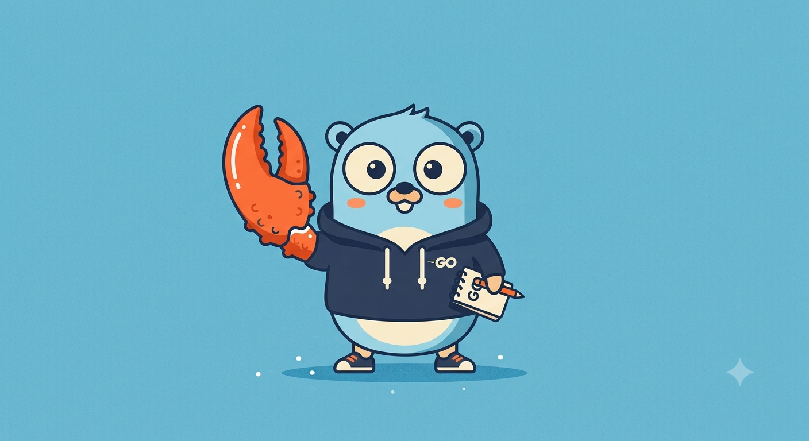

# goclaw

<p align="center">
  
</p>

A self-hosted personal-AI-agent host in Go + Podman: it routes chat messages
into per-agent-group containers where a Claude agent runs with OS-level
isolation, then delivers replies back. Inspired by NanoClaw; see
[`docs/nanoclaw-go-podman-brief.md`](docs/nanoclaw-go-podman-brief.md) for the
full design and [`docs/security.md`](docs/security.md) for the threat model.

The full message loop runs end to end: a real per-agent-group Podman container
drives Claude (multi-turn, with `/reset` and `/compact`), reads and writes a
knowledge vault, can clone repos and open pull requests, and runs scheduled
vault maintenance. The host pieces (router, delivery, sweep, permissions, mount
validation) are real and tested. An optional built-in **credential proxy** keeps
the raw API tokens (Anthropic and GitHub) out of the agent container, injecting
them on the wire so the container only ever sees a placeholder (see
[Credential proxy](#credential-proxy)); without it, the container holds the
tokens directly as a pragmatic shortcut.

## Layout

```text
cmd/goclaw/           entry: config, DB init, start loops, signal handling
cmd/claude-runner/    REAL in-container runner: drives Claude via agent-sdk-go
cmd/stub-runner/      echo stand-in for the runner (dev/testing)
internal/config/      env + .env configuration
internal/db/          central DB + migrations, session DB pair, queue helpers
internal/channels/    ChannelAdapter interface + registry
internal/channels/telegram/  Telegram adapter (the v0 channel)
internal/router/      resolution + access gate + approval flow → inbound.db (REAL)
internal/delivery/    outbound.db poll, delivery auth, adapter dispatch (REAL)
internal/sweep/       runner recovery + idle-runner GC (REAL)
internal/runtime/     Podman lifecycle (CLI shell-out) + mount builder + env
internal/mounts/      allowlist load + path validation (REAL, unit-tested)
internal/permissions/ roles, sender policy, access gate (REAL)
internal/credstore/   encrypted credential store (AES-256-GCM) for the proxy (REAL)
internal/credproxy/   host-side credential-injecting proxy (REAL)
internal/vault/       OneCLI credential-proxy wiring at spawn time (stub, alt path)
internal/vaultlock/   flock single-writer guard for the shared vault
container/            Containerfiles: runner (echo stub) + claude (real runner)
internal/vaultinit/   `goclaw vault init` installer + embedded vault template (brief §11)
```

## Build & run

```sh
go build ./...
go test ./...

# Run the host (Telegram disabled unless a token is set):
export TELEGRAM_BOT_TOKEN=...        # from @BotFather
go run ./cmd/goclaw
```

Config via environment:

| Var | Default | Purpose |
| --- | --- | --- |
| `GOCLAW_DATA_DIR` | `data` | root for central + session DBs |
| `GOCLAW_MOUNT_ALLOWLIST` | `~/.config/goclaw/mount-allowlist.json` | external mount allowlist (fail-closed if absent) |
| `TELEGRAM_BOT_TOKEN` | _(unset)_ | enables the Telegram channel |
| `GOCLAW_PODMAN_BIN` | `podman` | podman binary |
| `GOCLAW_SECRET_ENCRYPTION_KEY` | _(unset)_ | base64 32-byte key encrypting the credential store (see [Credential proxy](#credential-proxy)) |
| `GOCLAW_CREDPROXY_PORT` | `18080` | host port the credential proxy listens on |
| `GOCLAW_PROXY_CA_KEY` / `GOCLAW_PROXY_CA_CERT` | _(unset)_ | optional PEM override for the proxy CA; auto-generated under `{data_dir}/proxy/` if unset |

## Running the loop end to end

The full loop round-trips through a Podman container, one per agent group,
launched by the host on enqueue. For real Claude replies, jump to
[Real Claude runner](#real-claude-runner). The steps below use the **echo stub**
(`cmd/stub-runner`, no Claude/API key) to verify the plumbing first.

**1. Build the echo-stub image** (from the repo root):

```sh
podman build -f container/runner.Containerfile -t goclaw-runner:latest .
```

**2. Run the host with runner launch enabled**, pointed at the stub image (the
default is the Claude runner):

```sh
# .env
TELEGRAM_BOT_TOKEN=...                    # from @BotFather
GOCLAW_OWNER_TELEGRAM_ID=...              # your numeric Telegram id
GOCLAW_AUTO_WIRE_OWNER=1                  # first-run convenience
GOCLAW_LAUNCH_RUNNER=1                    # host launches the runner container
GOCLAW_RUNNER_IMAGE=goclaw-runner:latest  # the echo stub (omit for real Claude)

go run ./cmd/goclaw
```

Message the bot and you get `echo: <your text>` back. One container runs **per
agent group** (named `goclaw-<agentGroupID>`), mounting that group's sessions
directory at `/sessions` (`--user 1000:1000`, `--init`, `:Z`); the runner serves
every session subdir beneath it, echoing to outbound, and delivery sends the
reply.

Session storage on disk:

```text
data/sessions/<agentGroupID>/<sessionKey>/{inbound.db,outbound.db}
```

### Real Claude runner

The echo stub above proves the plumbing. To get actual Claude replies, use the
Claude runner image instead. It drives the `claude` CLI via
[`shindakun/agent-sdk-go`](https://github.com/shindakun/agent-sdk-go), so the
image bundles Node + the CLI.

```sh
# 1. Build the Claude runner image:
podman build -f container/claude.Containerfile -t goclaw-claude:latest .

# 2. .env - point at the Claude image and provide auth. RECOMMENDED: store the
#    key in the credential proxy instead (see below) so it never enters the
#    container. The direct-env key shown here is the simpler fallback.
GOCLAW_LAUNCH_RUNNER=1
GOCLAW_RUNNER_IMAGE=goclaw-claude:latest
GOCLAW_ANTHROPIC_API_KEY=sk-ant-api03-...   # fallback; prefer the credential proxy

go run ./cmd/goclaw
```

> **Recommended: use the [Credential proxy](#credential-proxy).** It keeps the
> raw Anthropic key (and your GitHub token) out of the agent container entirely.
> The direct `GOCLAW_ANTHROPIC_API_KEY` / `GOCLAW_GITHUB_TOKEN` shown here and
> below are the simpler path, but they put the real tokens inside the container
> where a prompt-injected agent could read them. With the proxy, the container
> only ever holds the literal string `placeholder`.

**Auth: use an API key.** A standard Anthropic API key
(`GOCLAW_ANTHROPIC_API_KEY`, from console.anthropic.com) is long-lived and the
runner keeps working indefinitely. A Claude Code subscription token
(`GOCLAW_CLAUDE_CODE_OAUTH_TOKEN`) is also supported and bills against your
Claude plan, **but it expires in ~12h and the container cannot refresh it** (on
macOS the live token is in the Keychain, unreachable from the container) - so it
will eventually 401 and you'll have to re-extract it. Prefer the API key for
anything left running. If both are set, the API key wins. Either way, the
[Credential proxy](#credential-proxy) is the more secure way to provide it.

> ⚠️ **Terms caution:** a Claude Code subscription token is intended for
> interactive Claude Code use, not for driving an automated/headless agent like
> this. Using it to run goclaw unattended may violate the subscription's terms of
> service. Check the current Anthropic / Claude terms before relying on it; for
> automation, the standard API key (billed as API usage) is the intended path.

Now messaging the bot gets a real Claude answer. The host passes the credential
into the container (`CLAUDE_CODE_OAUTH_TOKEN` or `ANTHROPIC_API_KEY`); the runner
calls `claude.Query` per message and writes the result to outbound.

**Conversation is multi-turn** - the runner persists Claude's session id per
conversation (in the session's `outbound.db`) and resumes it each message, so
Claude remembers the thread. Two chat commands manage it, and the runner
auto-compacts when the context window fills:

- `/reset` - forget this conversation, start fresh.
- `/compact` - summarize history to shrink context, keep the thread.

> ⚠️ **Security note:** by default the runner container holds the raw API key
> (passed as `ANTHROPIC_API_KEY`), which means the agent process can read it. To
> keep the key out of the container, use the [Credential proxy](#credential-proxy)
> below.

### Credential proxy

A built-in TLS-intercepting proxy keeps raw API tokens out of the agent container
(brief §8). The host holds the tokens encrypted; the runner routes its HTTPS
through the proxy (`HTTPS_PROXY`) and trusts the proxy's CA. The proxy injects
the real token per request at the host boundary, so a prompt-injected agent that
runs `echo $ANTHROPIC_API_KEY` or `echo $GH_TOKEN` gets only the literal string
`placeholder`. It covers Anthropic and GitHub today.

Set up:

```sh
# 1. A 32-byte base64 key that encrypts the credential store (keep it out of the
#    data dir; .env is fine, or source it from elsewhere).
export GOCLAW_SECRET_ENCRYPTION_KEY="$(head -c 32 /dev/urandom | base64)"

# 2. Store the real tokens. Each is encrypted at rest (AES-256-GCM) in goclaw.db,
#    never written in plaintext. The proxy matches an outbound request by target
#    host and injects the matching token.
goclaw auth add anthropic https://api.anthropic.com sk-ant-api03-...
# GitHub needs two hosts: github.com for `git clone`, api.github.com for `gh`.
goclaw auth add github https://github.com      github_pat_...
goclaw auth add github https://api.github.com  github_pat_...

goclaw auth list                 # id, name, target, masked token
goclaw auth delete <id>          # remove by the id from `list`
```

When a credential is stored (and the encryption key is set), the host starts the
proxy and launches runners with `HTTPS_PROXY` pointing at it, the CA mounted, and
**placeholder** values for `ANTHROPIC_API_KEY` / `GH_TOKEN` - so you do **not**
set `GOCLAW_ANTHROPIC_API_KEY` or `GOCLAW_GITHUB_TOKEN`. With no stored
credential, goclaw falls back to passing the raw tokens as before.

How it injects, per host:

- `api.anthropic.com` -> `x-api-key: <token>`
- `github.com` / `codeload.github.com` (git smart-HTTP) -> HTTP Basic
  `x-access-token:<token>` (the git endpoints reject Bearer)
- everything else, including `api.github.com` (the `gh`/API host) ->
  `Authorization: Bearer <token>`

Hosts with no stored credential are blind-tunneled: the proxy pipes the bytes
without decrypting, so that traffic stays end-to-end encrypted to its real
destination.

Notes and caveats:

- The agent's tools trust the proxy CA via `NODE_EXTRA_CA_CERTS` (the `claude`
  CLI), `GIT_SSL_CAINFO` (git/gh), and `SSL_CERT_FILE` (curl, Go, python). The CA
  is auto-generated under `{data_dir}/proxy/` (or supplied via
  `GOCLAW_PROXY_CA_KEY` / `GOCLAW_PROXY_CA_CERT`).
- `gh` is given a placeholder `GH_TOKEN` so it considers itself logged in (it
  checks locally before any request); the real token is injected on the wire.
- At-rest caveat: the encryption key lives in the environment, not the data dir,
  so a stolen data dir or DB dump does not include it - but a full host compromise
  still exposes both. This matches the standard "encrypt at rest with a local key"
  model. The proxy CA private key is similarly host-local.

You can also run the Claude runner directly (uses your host's logged-in Claude
session or `ANTHROPIC_API_KEY`):

```sh
go run ./cmd/claude-runner -dir data/sessions/<agentGroupID> -once
#   -model              override the model
#   -system-prompt-file e.g. a group's CLAUDE.md
```

### Development environment + GitHub

The Claude runner image is a real dev environment: git, the GitHub CLI (`gh`),
build-essential, Python 3, Go, ripgrep, jq, and more, so the agent can clone,
build, script, and open pull requests. To enable private clones and PRs, provide
a GitHub token.

> **Recommended: put the GitHub token in the [Credential proxy](#credential-proxy),
> not `GOCLAW_GITHUB_TOKEN`.** The proxy injects it on the wire so the container
> only sees a placeholder, whereas `GOCLAW_GITHUB_TOKEN` passes the raw token into
> the container as `GH_TOKEN` where the agent can read it. `git` and `gh` both work
> through the proxy (verified). Use a fine-grained PAT scoped to the repos you want
> the agent to reach.

The direct-env fallback:

```sh
# .env (simpler, but the raw token enters the container - prefer the proxy above)
GOCLAW_GITHUB_TOKEN=github_pat_...   # passed in as GH_TOKEN
GOCLAW_GIT_USER_NAME=Your Name       # commit author (defaults work)
GOCLAW_GIT_USER_EMAIL=you@example.com
```

Either way, "clone X, make this change, open a PR" works end to end: the agent
clones in `/work`, branches, commits (using your git identity), and runs
`gh pr create`. For a repo you don't own, `gh repo fork` pushes the branch to
your fork and opens the PR against upstream. Without any token, the agent can
still clone public repos but cannot push or open PRs.

### Knowledge vault

Give the agent a persistent, Obsidian-style Markdown vault it reads and writes
(brief §11). Install one from the embedded template, then point goclaw at it:

```sh
goclaw vault init              # installs to ~/Vault (or: goclaw vault init /path)

# .env
GOCLAW_VAULT_DIR=~/Vault
```

The host mounts the vault read-write at `/vault` in the agent-group container.
The runner reads `/vault/CLAUDE.md` as its system prompt (so the agent behaves as
the vault's librarian) and runs with edits auto-approved, since the container is
the sandbox. The agent then maintains the vault per the schema: typed notes,
frontmatter, an `index.md` catalog, and an append-only `log.md` audit trail. You
browse and edit the same folder in Obsidian; git tracks every change.

**Scheduled upkeep** runs automatically when a vault and an owner are configured
(brief §11.5): a morning day-note pass, a nightly reconcile + synthesize, and a
weekly lint. Each runs the agent against the vault and posts a one-line summary
to the owner's chat. The agent commits its changes with git, so set
`GOCLAW_GIT_USER_NAME` / `GOCLAW_GIT_USER_EMAIL` to your identity (defaults work).

### Without container launch

Leave `GOCLAW_LAUNCH_RUNNER` unset to start a runner out of band instead -
useful for development without rebuilding the image. Point it at an agent
group's sessions directory:

```sh
go run ./cmd/stub-runner -dir data/sessions/<agentGroupID>     # echo
go run ./cmd/claude-runner -dir data/sessions/<agentGroupID>   # real Claude
#   -once      process the current backlog and exit
#   -interval  poll cadence
```

`internal/delivery` has an on-disk round-trip test (`TestRoundTrip`), and
`internal/runtime` tests the launch argv + idempotent skip against a fake podman.

## Status / next steps

The full message loop works end to end through a real per-agent-group container.
Done: the real Go runner on [`shindakun/agent-sdk-go`](https://github.com/shindakun/agent-sdk-go)
(multi-turn, `/reset`, `/compact`, auto-compact); the knowledge vault mount with
scheduled maintenance; the GitHub dev environment (clone + open PRs); container
teardown / idle-runner GC (`internal/sweep`); and the
[Credential proxy](#credential-proxy) that keeps the raw Anthropic and GitHub
tokens out of the agent container (verified live).

Next:

1. More channels (Discord, then Slack) on the same `ChannelAdapter` interface
   (brief §7).
2. Validated extra mounts on the runner via the allowlist (brief §8).
3. More credential-proxy hosts as needed (the store and per-host injection are
   generic; add a host's auth scheme to `injectAuth` if it is neither x-api-key
   nor Bearer nor git-Basic).
